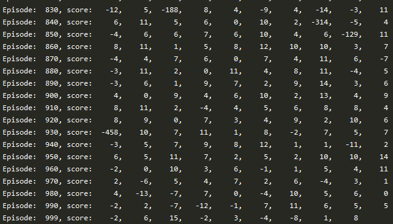

# Change log

2020-02-26:
- Multiprocessing of Taxi environments

2020-02-24:
- Updated model to be similar to the post:
    - https://tiewkh.github.io/blog/deepqlearning-openaitaxi
    
The starting results where the same, but by waiting to around episode 600 for
embedding with Dense, the learning kicks in and around 800 for embedding alone.

Lesson learnt... Patiences my friend, patiences.

2020-02-11:

- No converging result yet, tried different Adam learning rates, ranging from
    1e-1, 1e-2, 1e-3. The score is not improving above -200 for the first 300 episodes.
    
- Adjusted model to mach description in:
    - [RL for taxi v2](https://medium.com/@anirbans17/reinforcement-learning-for-taxi-v2-edd7c5b76869)
        - Embedding, Reshape, 3x Dense(50), output